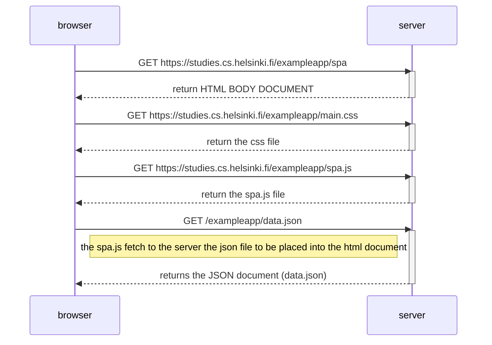

```mermaid
    sequenceDiagram
    participant browser
    participant server

    browser->>server: GET https://studies.cs.helsinki.fi/exampleapp/spa
    activate server

    server-->>browser: return HTML BODY DOCUMENT
    deactivate server

    browser->>server: GET https://studies.cs.helsinki.fi/exampleapp/main.css
    activate server

    server-->>browser: return the css file
    deactivate server

    browser->>server: GET https://studies.cs.helsinki.fi/exampleapp/spa.js
    activate server
    server-->>browser: return the spa.js file
    deactivate server

    browser->>server: GET /exampleapp/data.json
    activate server
    note right of browser: the spa.js fetch to the server the json file to be placed into the html document
    server-->>browser: returns the JSON document (data.json)
    deactivate server
    
```