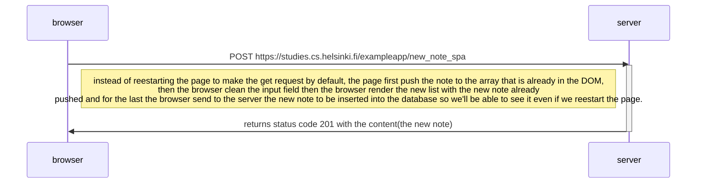

```mermaid 
    sequenceDiagram 

    participant browser
    participant browser

    browser->>server:POST https://studies.cs.helsinki.fi/exampleapp/new_note_spa
    activate server

    note right of browser: instead of reestarting the page to make the get request by default, the page first push the note to the array that is already in the DOM, <br> then the browser clean the input field then the browser render the new list with the new note already <br> pushed and for the last the browser send to the server the new note to be inserted into the database so we'll be able to see it even if we reestart the page.

    server->>browser: returns status code 201 with the content(the new note)
    deactivate server
```